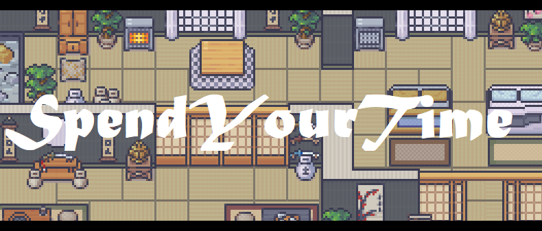

[GET]: <https://img.shields.io/badge/GET-darkgreen>
[POST]: <https://img.shields.io/badge/POST-blue>
[PUT]: <https://img.shields.io/badge/PUT-orange>
[PATCH]: <https://img.shields.io/badge/PATCH-blueviolet>
[DELETE]: <https://img.shields.io/badge/DELETE-darkred>
### Dependencies

## Routes
![GET]
![POST]
![PUT]
![PATCH]
![DELETE]

TYPE | PATH | ROUTE | DESCRIPTION | PARAMETERS | RESPONSE
--- | --- | --- | --- | --- | ---
![POST]| | `/login` | log user on API | `Form-data : {pseudo, password}` | `{token}`
![POST]| | `/register` | register user | `Form-data : {email, pseudo, password}` | `{token}`
![GET] | `/User` | `/` | return user data | `header : {token}`  | `{pseudo, email, player}`
![GET] | `/User` | `/:id` | return user data | `header : {token}`  | `{pseudo, email, player}`
![PUT] | `/User` | `/:id` | update user data | `header : {token}` `form-data : {pseudo, email, player}`  | `SUCCESS MESSAGE`
![DELETE] | `/User` | `/` | delete user | `header : {token}`  | `SUCCESS MESSAGE`
![GET] | `/Player`| `/skin` | return skin data | `header : {token}`  | `{skin}`
![PUT] | `/Player` | `/skin` | update skin data | `header : {token}` `form-data : {body, eyes, accessories, hairstyle, outfit}`  | `SUCCESS MESSAGE`
![PUT] | `/Player` | `/position` | update position data | `header : {token}` `form-data : {x, y}`  | `SUCCESS MESSAGE`
![GET] | `/Player` | '/guilds' | return guilds data | `header : {token}`  | `{array of guilds}`
![GET] | `/Player` | '/own' | return own guilds data | `header : {token}`  | `{array of guilds}`
![GET] | `/Guild` | `/` | return guild data | `header : {token}`  | `Array of {guild}`
![POST] | `/Guild` | `/` | create guild | `header : {token}` `form-data : {name, typeOfWork}`  | `SUCCESS MESSAGE`
![GET] | `/Guild` | `/:id` | return guild data | `header : {token}`  | `{guild}`
![PUT] | `/Guild` | `/:id` | update guild data | `header : {token}` `form-data : {guild}`  | `SUCCESS MESSAGE`
![DELETE] | `/Guild` | `/:id` | delete guild | `header : {token}`  | `SUCCESS MESSAGE`
![GET] | `/Guild` | `/:id/join` | join waiting list of guild | `header : {token}`  | `SUCCESS MESSAGE`
![GET] | `/Guild` | `/:id/leave` | leave guild | `header : {token}`  | `SUCCESS MESSAGE`
![GET] | `/Guild` | `/:id/owner` | return owner of guild | `header : {token}`  | `{User}`
![GET] | `/Guild` | `/:id/members` | return members of guild | `header : {token}`  | `{Array of User}`
![GET] | `/Guild` | `/:id/waiting` | return waiting members of guild | `header : {token}`  | `{Array of User}`
![GET] | `/Guild` | `/:id/accept` | accept member of guild | `header : {token}`  | `SUCCESS MESSAGE`
![GET] | `/Guild` | `/:id/decline` | decline member of guild | `header : {token}`  | `SUCCESS MESSAGE`
![GET] | `/Guild` | `/:id/kick` | kick member of guild | `header : {token}`  | `SUCCESS MESSAGE`